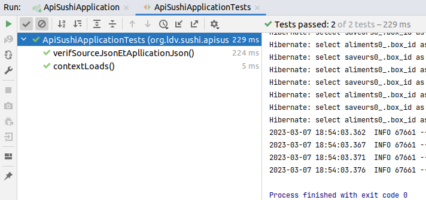

= API-Sushi
:toc-title: Table des matières
:toclevels: 4
:toc: top

== Objectif

Cette application Spring Boot Kotlin a pour finalité de mettre à disposition un service web de type API REST, au service d'applications frontend Angular que des étudiants développeurs d'applications doivent réaliser, en mode projet.

L'API doit fournir une liste de boxes sushi, disponible à la commande, au format JSON.

Le format initial JSON est imposé (provient d'une situation réelle), et placé à la racine de l'application :  link:boxes-sushi.json[boxes-sushi.json].

Le but de ce projet est de concevoir una application web qui produise ce résultat via une API HTTP.

On suppose que l'application s'appuie sur une base de donnée relationnelle, au minimum en 3ième forme normale.

C'est une activité de retro-ingénierie.

== Analyse de la structure JSON initiale

Une analyse du domaine métier s'impose (recherche des dépendances, fonctionnelles et multivaluées réciproques, directes et élémentaires)

Après étude des données JSON, nous constatons qu'une boxe est composée de propriétés simples (valeur de type numérique ou string), une liste de saveurs (String) et une liste d'aliments (objets).

Exemple de la liste des boxes, on ne prend que les 2 premières boxes, (représentation via plantuml)

.Structure JSON initiale
[plantuml]
----
@startjson
[
    {
        "id": 1,
        "nom": "Tasty Blend",
        "pieces": 12,
        "prix": 12.50,
        "image": "tasty-blend",
        "aliments": [
            {
                "nom": "California Saumon Avocat",
                "quantite": 3
            },
            {
                "nom": "Sushi Saumon",
                "quantite": 3
            },
            {
                "nom": "Spring Avocat Cheese",
                "quantite": 3
            },
            {
                "nom": "California pacific",
                "quantite": 3
            },
            {
                "nom": "Edamame/Salade de chou",
                "quantite": 1
            }
        ],
        "saveurs": [
            "saumon",
            "avocat",
            "cheese"
        ]
    },
    {
        "id": 2,
        "nom": "Amateur Mix",
        "pieces": 18,
        "aliments": [
            {
                "nom": "Maki Salmon Roll",
                "quantite": 3
            },
            {
                "nom": "Spring Saumon Avocat",
                "quantite": 3
            },
            {
                "nom": "Maki Cheese Avocat",
                "quantite": 6
            },
            {
                "nom": "California Saumon Avocat",
                "quantite": 3
            },
            {
                "nom": "Edamame/Salade de chou",
                "quantite": 1
            }
        ],
        "saveurs": [
            "coriandre",
            "saumon",
            "avocat",
            "cheese"
        ],
        "prix": 15.90,
        "image": "amateur-mix"
    }
]
@endjson
----
== Analyse conceptuelle

Après analyse de la structure JSON, nous dégageons les concepts suivants :

.Vue conceptuelle
[plantuml]
----
@startuml
class Box {
id
nom
nbPieces
prix
image
}

class Saveur {
id
nom
}

class Aliment {
id
nom
}

class AlimentBox {
  quantite
}

Box "*" - "1..*" Saveur:"\t\t\t"
Box " *  " -- " *  " Aliment
(Box, Aliment) . AlimentBox

hide circle
@enduml
----

Cette analyse identifie deux associations de type `ManyToMany`, dont une porteuse d'une propriété (quantité), représentée par la classe association `AlimentBox`.

== Analyse conceptuelle par réification de la classe association

Technique qui tend à uniformiser la représentation des entités.

(c'est cette version de l'analyse qui est retenue pour la représentation du domaine)

.Réification de la classe association
[plantuml]
----
@startuml
class Box {
id
nom
nbPieces
prix
image
}

class Saveur {
id
nom
}

class Aliment {
id
nom
}

class AlimentBox <<associacion>>{
  id
  quantite
}

Box "*" - "1..*" Saveur:"\t\t\t"
Box  "1" -- "*" AlimentBox:"\t\t\t\t"
AlimentBox  "*" - "1"  Aliment:"\t\t\t"

Note left of AlimentBox : Unique : (Box, Aliment)

hide circle
@enduml
----

TIP: La contrainte d'unicité permet de conserver le statut de _classe association_. Une simplicité gagnant-gagnant.

== Les images

Les images placées dans le sous-dossier `/resources/static/assets`, sont gérées via un contrôleur dédié (`Imagecontroller`)

Exemple : http://localhost:8080/api/image/tasty-blend

[NOTE]
====
Vérifier, au cas où, la route à appliquer dans le code du contrôleur.

Le contrôleur `Imagecontroller` retourner quand même une image si celle demandée n'existe pas (un exemple d'application du design pattern _null-object_)
====
== Mapping Objet Relationnel

Le mapping se base sur <<_analyse_conceptuelle_par_réification_de_la_classe_association>>.

On retrouvera donc les classes du domaine métier dans le dossier `domain`.

[source, bash]
----
domain/
├── AlimentBox.kt
├── Aliment.kt
├── Box.kt
└── Saveur.kt
----

.Détail de l'implémentation
[source, kotlin]
----
@Entity
class Aliment(val nom: String ) {
    @Id
    @GeneratedValue(strategy = GenerationType.IDENTITY)
    var id: Long? = null
}

@Entity
class Saveur(val nom: String) {
    @Id
    @GeneratedValue(strategy = GenerationType.IDENTITY)
    var id: Long? = null
}

@Entity
class Box(
    var nom: String = "",
    var nbPieces: Int = 0,
    var image: String = "",
    var prix: Double = 0.0
) {
    @ManyToMany
    var saveurs = mutableSetOf<Saveur>()

    @OneToMany(mappedBy = "box")
    var aliments = mutableListOf<AlimentBox>()

    @Id
    @GeneratedValue(strategy = GenerationType.IDENTITY)
    var id: Long? = null
}

@Entity
@Table( uniqueConstraints = [UniqueConstraint(columnNames = ["box_id", "aliment_id"])])
class AlimentBox (@ManyToOne var box: Box,
                  @ManyToOne var aliment: Aliment,
                  var quantite: Float)
{
    @Id
    @GeneratedValue(strategy = GenerationType.IDENTITY)
    var id: Long? = null
}

----

Pour la représentation JSON, on se référera au dossier  `dto` dans lequel sont définies les classes `AlimentBoxDtoJson` et `BoxDtoJson`.

== Application properties

L'application s'appuie sur un SGBDR en mémoire (h2)

En cas d'une solution persistante, penser à placer le mode dll à update un fois la base de données créée (schéma)

[source, properties]
----
spring.datasource.url=jdbc:h2:mem:sushi
# spring.datasource.url=jdbc:h2:~/db/apisushi;AUTO_SERVER=TRUE
spring.datasource.driver-class-name=org.h2.Driver
spring.datasource.username=sa
spring.datasource.password=
spring.jpa.database-platform=org.hibernate.dialect.H2Dialect

# first create then update
spring.jpa.hibernate.ddl-auto=create
----

En mode persistant, la base de données peut être consultée :

et obtenir un dump de la base (`data-h2.sql`), bien pratique pour initialiser la base de données pour les tests unitaires (dans la branche test)

Le fichier `data-h2.sql` nous servira à vérifier qu'à partir de la base de données obtenue, l'application est capable de reproduire la sortie JSON initiale (objet d'un test unitaire plus loin)

[NOTE]
====
Pour information seulement, voici le schéma relationnel produit par l'ORM Hibernate pour H2.

.Schéma relationnel généré par l'ORM pour H2 (5 tables)

====

== Initialisation de la base de données

On se réfère à la classe `DatabaseInitializer`, qui hérite de `ApplicationRunner`. Sa méthode `run` est lancée automatiquement au démarrage de l'application.

L'algorithme est un ETL qui prend en entrée un fichier JSON décrivant des boxes sushi et injecte les données dans une base de données relationnelle.

C'est la fonction inverse de l'API.

Pour l'essentiel, les boxes sont créées et sauvegardées dans la base de données, ainsi que les nouveaux aliments et nouvelles saveurs si nécessaire. Puis la liste des aliments qui caractérise la boxe, avec leur quantité, est créée et sauvegardée.

[source, kotlin, number]
----
val mapper = jacksonObjectMapper()
val boxesJsonStr: String = File("./boxes-sushi.json").readText(Charsets.UTF_8)
val boxesDtoJsonList: List<BoxDtoJson> = mapper.readValue(boxesJsonStr)

for (boxDtoJson in boxesDtoJsonList) {
  val box: Box = Box(
      boxDtoJson.nom,
      boxDtoJson.pieces,
      boxDtoJson.image, boxDtoJson.prix
  )

  for (saveurNom in boxDtoJson.saveurs) {
      val s: Saveur = saveurRepository.findOrCreateSaveur(saveurNom)
      box.saveurs.add(s)
  }

  // save a new box
  boxRepository.save(box)

  for (alimentBoxDtoJson in boxDtoJson.aliments) {
     // first create/save aliment if not exists
     val aliment = alimentRepository.findOrCreateAliment(alimentBoxDtoJson.nom)
     // create/save new AlimentBox
     alimentBoxRepository.save(AlimentBox(box, aliment, alimentBoxDtoJson.quantite))
  }
}
----

== Vérification via un test unitaire

La branche de test
[source, bash]
----
src/test/
├── kotlin
│   └── org
│       └── ldv
│           └── sushi
│               └── apisushi
│                   └── ApiSushiApplicationTests.kt
└── resources <1>
    ├── application-test.properties <2>
    └── data-h2.sql <3>

----
<1> Un dossier `resources` est créé, avec `test` comme parent
<2> Un fichier de configuration dédié
<3> La base de données de test gnénérée à partir de la command `SCRIPT TO` de `H2` illustrée ici :  <<_application_properties>>

=== Explication de properties et data-h2.sql

.src/test/resources/application-test.properties
[source, properties]
----
spring.datasource.url=jdbc:h2:mem:sushi
spring.datasource.driver-class-name=org.h2.Driver
spring.datasource.username=sa
spring.datasource.password=
spring.jpa.database-platform=org.hibernate.dialect.H2Dialect

# applique une initialisation de la DB via data-h2.sql dans test/resources/

# attention, application.properties de base est également interprété,
# donc si spring.jpa.hibernate.ddl-auto=create, la base de données sera vide
# (la mettre en update)

# pour activer data-h2.sql (convention de nommage imposée)
spring.batch.jdbc.initialize-schema=always
spring.sql.init.platform=h2

----
=== La classe des tests unitaires

.src/test/.../ApiSushiApplicationTests.kt
[source, typescript]
----

@TestPropertySource(
	locations = ["classpath:application-test.properties"]) <1>
@DataJpaTest
class ApiSushiApplicationTests @Autowired constructor(
var boxRepository: BoxRepository
) {

var logger: Logger = org.slf4j.LoggerFactory.getLogger(ApiSushiApplicationTests::class.java)

@Test
fun contextLoads() {
  Assertions.assertTrue(true)
}

@Test
 fun verifSourceJsonEtApllicationJson() {
  // compare le fichier JSON d'origine avec la version produite par l'application
  val FILE_NAME_JSON = "./boxes-sushi.json"

  val boxesJsonStr: String = File(FILE_NAME_JSON).readText(Charsets.UTF_8)

  val mapper = jacksonObjectMapper() <2>

  val boxesJsonFromDataBase: String =
      mapper.writerWithDefaultPrettyPrinter()
        .writeValueAsString(
          (this.boxRepository.findAll().map { fromBoxToBoxDtoJson(it)})
            .toList()) <3>

  JSONAssert.assertEquals(boxesJsonStr, boxesJsonFromDataBase, false) <4>
 }
}

----
<1> Prise en compte deu fichier de configuration
<2> On utilise la bibliothèque jackson initialement intégrée dans l'écosystème
<3> Transmforme chaque élément de type `Box` en une instance de `BoxDtoJson` et demande une représentation textuelle de la collection (du JSON sérialisé en string)
<4> Utilise la bibliothèque `JSONAssert` (_Library for writing tests that checks JSON documents (useful for testing responses from REST services_) pour comparer 2 représentation JSON sans tenir compte de l'ordre des éléments internes.

=== Résultat des tests

[NOTE]
====
Initialement le premier test avait échoué. Nous avions typé la propriété `quantite` en `Int`, mais, sur une boxe (la _Sando Box Chicken Katsu_), la valeur de quantité de l'élément _Sando Chicken Katsu_ est de `0.5`, or nous avions `0` (arrondi en nombre entier).

Ainsi le test unitaire a bien fait son travail. La correction a consisté à changer le type de quantité en `Float`.
====

== Le contrôleur

En se basant sur `RestController`, on retourne une liste des boxes au format `BoxDtoJson` (qui mappe la structure de données de la version JSON initiale)

.src/.../controller/ApiController
[source, typescript]
----

@RestController
class ApiController @Autowired constructor(private val boxRepository: BoxRepository) {

    @GetMapping("/api/boxes")
    fun allBoxes(): ResponseEntity<List<BoxDtoJson>> {
        return ResponseEntity.ok(this.boxRepository.findAll().map { fromBoxToBoxDtoJson(it) })
    }
}

----

== Lancement de l'application

=== Dans l'IDE

C'est une application Spring Boot basée sur une base de données H2 (in memory).  Vous pouvez ainsi lancer l'application avec comme point d'entrée la classe `ApiSushiApplication`.

=== En tant qu'exécutable (phase de déploiement)

Il n'est pas concevable d'avoir besoin d'un IDE pour lancer l'application en mode production.

Il faut générer une version exécutable de l'application, que l'on déploie sur un serveur.

* Génération d'un exécutable via l'IDE IntelliJ

Sur la droite, ouvrit l'onglet `Maven` et sélectionner la tache *package*. L'action crée un exécutable .jar dans le dossier `target`.

Le nom de l'exécutable est déterminé en fonction des informations de version présentes dans le `pom.xml`.  Dans notre cas on obtient un fichier jar :  `api-sushi-0.0.X-SNAPSHOT.jar`

* Lancement en ligne de commande

. Copier le jar dans un dossier
. Lancer la commande `java -jar ./api-sushi-0.0.X-SNAPSHOT.jar`

La liste des boxes est accessible via : http://localhost:8080/api/boxes
(voir le code du contrôleur)

Problème éventuel : le port 8080 est occupé. Choisir un autre port en passant un argument de la forme `--server.port=<numéro de port>`. Exemple

 java -jar ./api-sushi-0.0.4-SNAPSHOT.jar --server.port=8088

TIP: Le serveur et application s'arrêtent par un `CTRL+C` dans le terminal qui a lancé la commande comme signalé précédemment (sinon il faut tuer le processus)

== Contraintes CORS

Le service, une fois lancé, est prêt à recevoir des requêtes HTTP, à une contrainte _Cross Origin_ près. Voir :

* Présentation de CORS : https://developer.mozilla.org/fr/docs/Web/HTTP/CORS

* Des solutions avec Spring Boot : https://spring.io/guides/gs/rest-service-cors/

IMPORTANT: Comme vous vous en rendrez avec votre application Angular, des modifications au code source de ce projet sont donc nécessaires pour résoudre les problèmes de partage des ressources entre origines multiples.

== Améliorations possibles

(une TODO liste)

- API : Ajouter l'accès à une boxe seulement, via son id. Exemple
+
http://localhost:8080/api/boxe/8

